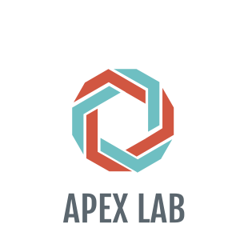
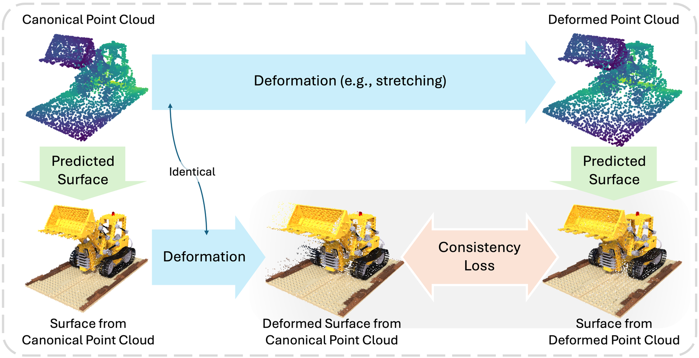

# P-CORE: Self-Supervised Surface Consistency for Point-Based Neural Editing (ECCV 2026)
[Yanshu Zhang](https://zvict.github.io/)<sup>1†</sup>, [Shichong Peng](https://sites.google.com/view/niopeng/home)<sup>1</sup>, Mehran Aghabozorgi<sup>1</sup>, [Alireza Moazeni](https://amoazeni75.github.io/)<sup>1</sup>, [Ke Li](https://www.sfu.ca/~keli/)<sup>1,2,3</sup><br>
<sup>1</sup>Simon Fraser University &nbsp;&nbsp; <sup>2</sup>Amii &nbsp;&nbsp; <sup>3</sup>CIFAR &nbsp;&nbsp; (<sup>†</sup>corresponding author)<br>



[Project Page](https://zvict.github.io/p-core/)
 | [Paper](https://zvict.github.io/p-core/static/pdfs/pcore_eccv2026.pdf) |
 [arXiv](https://arxiv.org/abs/2609.03349) <br>
Primary contact: [Yanshu Zhang](https://zvict.github.io/)



## BibTeX
 <strong>P-CORE: Self-Supervised Surface Consistency for Point-Based Neural Editing</strong>. &nbsp;&nbsp;&nbsp;
```
@inproceedings{zhang2026pcore,
    title={P-CORE: Self-Supervised Surface Consistency for Point-Based Neural Editing},
    author={Yanshu Zhang and Shichong Peng and Mehran Aghabozorgi and Alireza Moazeni and Ke Li},
    booktitle={European Conference on Computer Vision (ECCV)},
    year={2026}
}
```

## Installation
```bash
git clone https://github.com/zvict/p-core
cd p-core
conda create -n pcore python=3.11 -y
conda activate pcore

pip install torch==2.10.0 torchvision==0.25.0 --index-url https://download.pytorch.org/whl/cu128
conda install -c nvidia cuda-toolkit=12.8 -y
export CUDA_HOME="$CONDA_PREFIX"
pip install ninja "setuptools<81" wheel
pip install --no-build-isolation \
  "git+https://github.com/facebookresearch/pytorch3d.git"
pip install --no-build-isolation \
  "git+https://github.com/NVlabs/tiny-cuda-nn.git"
pip install -r requirements.txt
```
Verify the compiled dependencies before downloading data:
```bash
python -c "import torch, pytorch3d, tinycudann; print(torch.__version__, torch.version.cuda)"
```

## Data Preparation
```
p-core
├── train.py, finetune.py, test.py
├── configs
│   ├── neural_editor      # chair drums ficus hotdog lego materials mic ship
│   └── objaverse          # butterfly crab dolphin giraffe lego legoman
├── data                   # canonical scenes, for training
│   ├── nerf_synthetic
│   │   ├── lego
│   │   │   ├── train, test
│   │   │   ├── transforms_train.json, transforms_test.json
│   │   │   ├── random_init_points3d.ply
│   │   ├── ...
│   ├── Objaverse
│   │   ├── dolphin
│   │   │   ├── start
│   │   ├── ...
├── 2dgs                   # 2DGS initial point clouds and depth supervision
│   ├── objaverse_999999999/<scene>/point_cloud/iteration_30000/point_cloud.ply
│   ├── objaverse_999999999/dolphin/test/ours_30000/vis   # dolphin stage 1 only
├── datasets               # deformed views, for evaluation only
│   ├── neural_editor/<scene>/views_test
│   ├── objaverse/<scene>/end
├── edits                  # <benchmark>/<scene>/points.ply — the deformed point clouds
├── checkpoints            # <benchmark>/<scene>/model.pth, plus base_model.pth
│                          # for neural_editor/ship and objaverse/lego
└── experiments            # where runs are written
```
`data/` and `2dgs/` are used for training; `datasets/` and `edits/` only at evaluation.

Download the NeRF Synthetic Dataset from [here](https://drive.google.com/drive/folders/128yBriW1IG_3NJ5Rp7APSTZsJqdJdfc1) and put it under `data/nerf_synthetic/`. Everything else — our processed PAPR-in-Motion Objaverse subset, the deformed views, the deformed point clouds, and the 2DGS initializations — is on [Hugging Face](https://huggingface.co/victor678/p-core):
```bash
hf download victor678/p-core --local-dir .
```
Every path in a config is a plain repo-relative string used exactly as written, so a config can be pointed elsewhere by editing it or with `--set`.

## Overview
```
config.py       defaults merge, phase selection, shared training CLI
checkpoint.py   checkpoint I/O and strict state loading
dataset/        Blender-format cameras, images, patches, and rays
models/         the PAPR renderer: proximity attention, U-Net, losses
training/       the trainer and the surface-consistency objective
evaluation/     rendering protocols and metrics
```
There is one config per scene, holding both stages. Stage 1 reconstructs the scene in its canonical space; stage 2 fine-tunes that checkpoint with the self-supervised surface-consistency objective; `test.py` then renders the deformed views the model has never seen.

## Training
```bash
python train.py --opt configs/neural_editor/lego.yaml --output-dir experiments/lego
```
Reconstruction uses only the canonical views. Runs are long (~250k steps for the released checkpoints): `--save-every N` writes resumable checkpoints and `--resume PATH` continues one exactly. `--set KEY=VALUE` applies dotted YAML overrides, for example `--set dataset.batch_size=16`.

## Fine-tuning with surface consistency
```bash
python finetune.py --opt configs/neural_editor/lego.yaml --output-dir experiments/lego-sc
```
500 updates of the surface-consistency objective, starting from the reconstruction checkpoint named in the config. No ground-truth deformed views are used. Flags match `train.py`.

## Evaluation
```bash
python test.py --opt configs/neural_editor/lego.yaml --output-dir results/lego --save-images
```
Renders the scene's deformed views and reports PSNR, SSIM, and LPIPS. By default this evaluates the reconstruction-only model using the released checkpoint. To evaluate a fine-tuned model instead:
```bash
python test.py --opt configs/neural_editor/lego.yaml \
  --phase self-consistency \
  --checkpoint experiments/lego-sc/checkpoint_000500.pt \
  --output-dir results/lego-sc --save-images
```

## Pretrained Models
All released weights are on [Hugging Face](https://huggingface.co/victor678/p-core): one `model.pth` per scene, plus the `base_model.pth` reconstruction parents that `neural_editor/ship` and `objaverse/lego` initialize from. The `hf download` command above places them where the configs expect.

## Acknowledgement
The renderer and several utility modules derive from [PAPR: Proximity Attention Point Rendering](https://github.com/zvict/papr) (NeurIPS 2023 Spotlight). `models/loss.py` adapts the SSIM implementation from [Po-Hsun-Su/pytorch-ssim](https://github.com/Po-Hsun-Su/pytorch-ssim) (MIT), and `models/sh.py` follows the reference code of [Efficient Spherical Harmonic Evaluation](https://jcgt.org/published/0002/02/06/), JCGT 2(2). This project's own code is released under the [MIT License](LICENSE), and [CITATION.cff](CITATION.cff) carries the citation metadata.
